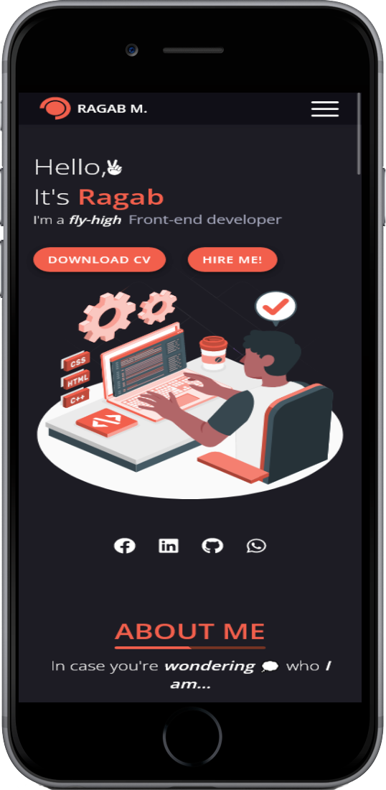
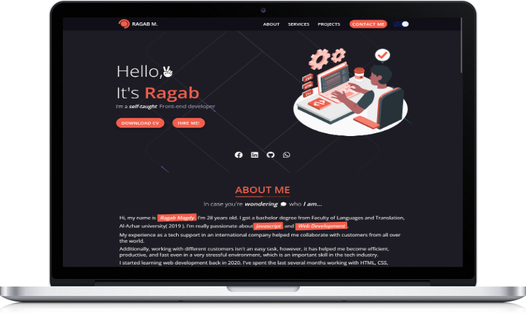
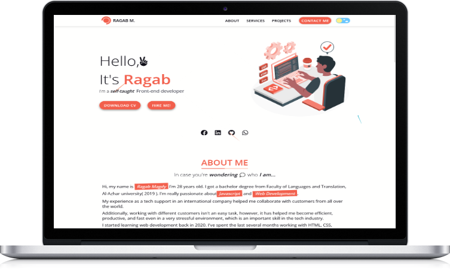

## Table of contents

- [Overview](#overview)
  - [Screenshot](#screenshot)
  - [Links](#links)
  - [Built with](#built-with)
  - [Continued development](#continued-development)
- [Author](#author)

## Overview

### Screenshot

- Mobile Dark

- Mobile Light

- Desktop Dark

- Desktop Light

### Links

- Live Site URL: [@via Vercel](https://bogafolio.vercel.app)
- Live Site URL: [@via Netlify](https://bogafolio.netlify.app/)

### Built with

- [React](https://reactjs.org/) - JS library
- [Vite](https://vitejs.dev/) - Build tool
- [styled-components](https://styled-components.com/) - CSS for the <Component>
- [emailjs](https://www.emailjs.com/) (send emails using client-side technologies only)
- React-Form-Hooks (control form inputs & validation)
- React-dark-mode-toggle (toggle between light & dark mode)
- React-Toastify ( style toast message )
- React Hooks ( useState , useEffect )
  
### Continued development

Build more projects with Reactjs

## Author

- Website - [Ragaboga](https://bogafolio.vercel.app)
